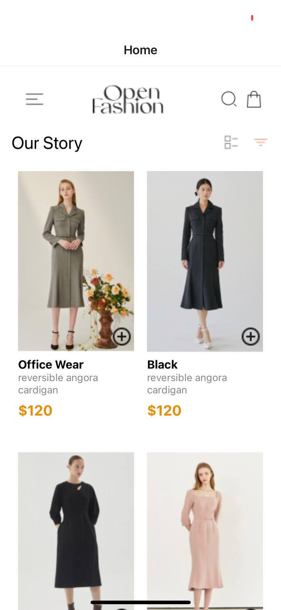
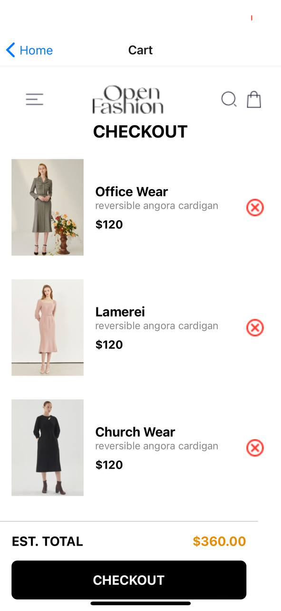
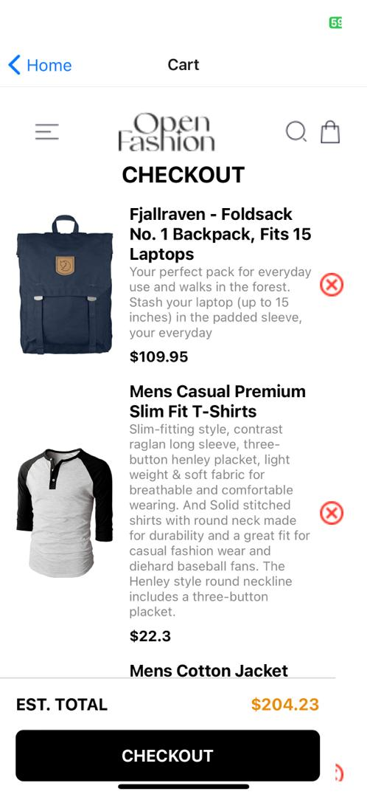
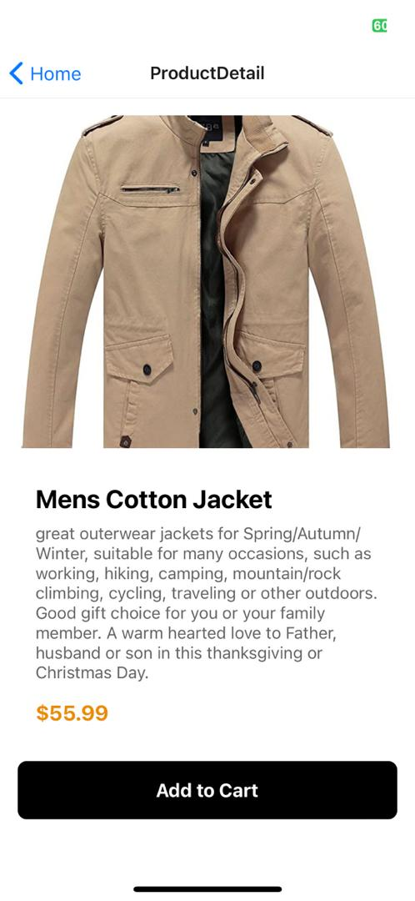
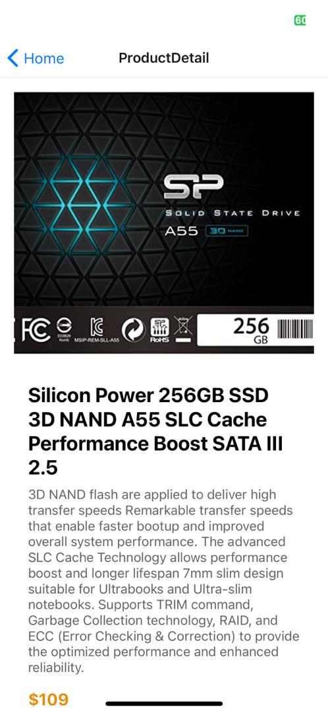

Index Number: 11165792

## Overview
The mobile application was designed to show how the AsyncStorage functions in a mobile application and also some other functionalities. The app includes the Home screen and Cart Screen.

## Features
* Home Screen: Displays the main content of the app with user-friendly navigation.
* Cart Screen: Allows users to customize their preferences.
* View a list of available products.
* Add products to their cart.
* Remove products from their cart.
* View the items in their cart.
* Product Screen to veiw products.

## Development Process
* Setup: Started with setting up the React Native environment and initializing the project.
* Navigation: Implemented React Navigation for managing screen transitions.
* UI Design: Styled the application using Styled Components to match the provided UI mockup.
* Custom Components: Created reusable custom components for headers, buttons, and other UI elements.
* Testing: Tested the application on various devices to ensure compatibility and responsiveness.

## Usage
* Tested the app to ensure that the products selected where shown on the checkout page
* Ensured the addition of the numbers was accurate.
* Made sure the information gotten from the API was correct

## Screenshots 

